# Rill Cost Analytics Dashboards

Multi-cloud cost visualization combining AWS, GCP, and Stripe data using Rill.

## Quick Start

```bash
make serve  # Opens Rill at http://localhost:9009
```

## Data Flow


```mermaid
graph TB

subgraph "1: EXTRACT (dlt)"
    A1[AWS S3<br/>CUR Parquet]
    A2[GCP BigQuery<br/>Billing Export]
    A3[Stripe API<br/>Revenue]

    P1[aws_pipeline.py<br/>📥 Incremental]
    P2[google_bq_pipeline.py<br/>📥 Incremental]
    P3[stripe_pipeline.py<br/>📥 Incremental]

    A1 --> P1
    A2 --> P2
    A3 --> P3
end

subgraph "2: NORMALIZE (Python + DuckDB)"
    N1[normalize.py<br/>🔧 Flatten MAP columns]
    N2[normalize_gcp.py<br/>🔧 Flatten nested data]

    P1 --> N1
    P2 --> N2
    P3 --> R1
end

subgraph "3: RAW STORAGE (Parquet)"
    R1[data/aws_costs/<br/>normalized.parquet]
    R2[data/gcp_costs/<br/>normalized.parquet]
    R3[data/stripe_costs/<br/>balance_transaction.parquet]

    N1 --> R1
    N2 --> R2
end

subgraph "4: MODEL (SQL - Star Schema)"
    M1[aws_costs.sql<br/>🔷 Dimensions + Facts]
    M2[gcp_costs.sql<br/>🔷 Dimensions + Facts]
    M3[stripe_revenue.sql<br/>🔷 Dimensions + Facts]
    M4[unified_cost_model.sql<br/>🌟 UNION ALL + Currency Conversion]

    R1 --> M1
    R2 --> M2
    R3 --> M3

    M1 --> M4
    M2 --> M4
    M3 --> M4
end

subgraph "5: METRICS & DASHBOARDS (Rill)"
    MV1[aws_cost_metrics.yaml<br/>📊 KPIs & Measures]
    MV2[gcp_cost_metrics.yaml<br/>📊 KPIs & Measures]
    MV3[cloud_cost_metrics.yaml<br/>📊 Unified Metrics]

    D1[🎨 AWS Dashboard]
    D2[🎨 GCP Dashboard]
    D3[🎨 Cloud Cost Explorer<br/>Multi-Cloud + Revenue]

    M4 --> MV1
    M4 --> MV2
    M4 --> MV3

    MV1 --> D1
    MV2 --> D2
    MV3 --> D3
end

style P1 fill:#4A90E2,stroke:#2E5C8A,color:#fff
style P2 fill:#4A90E2,stroke:#2E5C8A,color:#fff
style P3 fill:#4A90E2,stroke:#2E5C8A,color:#fff
style N1 fill:#9B59B6,stroke:#7D3C98,color:#fff
style N2 fill:#9B59B6,stroke:#7D3C98,color:#fff
style M4 fill:#E74C3C,stroke:#C0392B,color:#fff
style MV3 fill:#27AE60,stroke:#1E8449,color:#fff
style D3 fill:#F39C12,stroke:#D68910,color:#fff

```

## Structure

```
viz_rill/
├── dashboards/              # Static dashboards (always work)
│   ├── aws_overview.yaml           # AWS cost analytics + RI/SP tracking
│   ├── aws_explore.yaml            # Interactive AWS explorer
│   ├── aws_product_insights.yaml   # Product dimension analysis
│   └── cloud_cost_explore.yaml     # Multi-cloud overview
├── sources/                 # Data sources
│   └── aws_cost_normalized.yaml    # AWS CUR (queries parquet directly)
├── metrics/                 # Metric definitions
│   ├── aws_cost_metrics.yaml       # 20+ AWS-specific measures
│   └── cloud_cost_metrics.yaml     # Multi-cloud metrics
├── models/                  # SQL transformations
│   ├── aws_costs.sql
│   ├── stripe_revenue.sql
│   └── unified_cost_model.sql
├── data/                    # Parquet files (gitignored)
├── aws-cur-wizard/          # Scripts & templates from aws-cur-wizard
│   ├── scripts/                    # Python generators
│   └── templates/                  # Jinja2 templates
├── canvases/                # Generated dashboards (optional, gitignored)
└── explores/                # Generated explorers (optional, gitignored)
```

## How It Works

### Static Dashboards (Default)

Our hand-crafted dashboards query raw parquet files directly via SQL:

```
data/aws_costs/*.parquet
  ↓
sources/aws_cost_normalized.yaml (SQL query)
  ↓
metrics/aws_cost_metrics.yaml (20+ measures)
  ↓
dashboards/*.yaml (visualizations)
```

**No preprocessing needed** - just run `make serve`!

### Dynamic Dashboards (Optional)

Using aws-cur-wizard scripts to auto-generate dimension-specific canvases:

```bash
make aws-dashboards  # Analyzes your data, generates custom canvases
make serve          # View static + generated dashboards
```

This creates additional dashboards in `canvases/` and `explores/` folders based on your data's dimensions.

## Two Approaches

| Approach | Files | When to Use |
|----------|-------|-------------|
| **Static** | `dashboards/` | Daily use - fast, version controlled, works immediately |
| **Dynamic** | `canvases/`, `explores/` | When you add resource tags or need dimension analysis |

Both work together - you can use static dashboards alone or add dynamic generation for advanced analysis.

## aws-cur-wizard Integration

The `aws-cur-wizard/` folder contains scripts and templates from [aws-cur-wizard](https://github.com/Twing-Data/aws-cur-wizard) (MIT License) for dynamic dashboard generation.

**What it does**:
- Analyzes AWS CUR data schema
- Intelligently selects chart types based on cardinality
- Generates dimension-specific canvases
- Handles resource tags elegantly

**When you run** `make aws-dashboards`:
1. `normalize.py` - Flattens AWS data → `data/normalized_aws.parquet`
2. `generate_rill_yaml.py` - Analyzes schema, renders Jinja2 templates
3. Outputs YAML files → `canvases/`, `explores/`

See `aws-cur-wizard/README.md` for detailed attribution and how the algorithm works.

## Key Features

### Static Dashboards Provide:
- Effective Cost (RI/SP amortized)
- RI Utilization tracking
- Regional cost distribution
- Multi-account breakdown
- Unit economics
- Marketplace spend isolation
- Multi-cloud support (AWS + GCP + Stripe)

### Dynamic Generation Adds:
- Automatic chart type selection
- Dominant value detection (shows top spenders as KPIs)
- Tag-specific canvases
- Adapts to schema changes

## Data Flow

```
dlt Pipelines                    Rill Sources
pipelines/                       sources/
  ├── aws_pipeline.py      →→    ├── aws_cost_normalized.yaml
  ├── google_bq_*.py       →→    ├── (future: gcp_source.yaml)
  └── stripe_pipeline.py   →→    └── (unified in models/)
        ↓                              ↓
    Parquet files                 SQL queries
    data/*/                           ↓
                                  Metrics & Dashboards
                                  metrics/, dashboards/
```

## Generated vs Static Files

**In Git** (version controlled):
- `dashboards/` - Our static dashboards
- `sources/` - Data source queries
- `metrics/` - Metric definitions
- `models/` - SQL transformations
- `aws-cur-wizard/` - Generator scripts & templates

**Generated** (gitignored, recreated on demand):
- `canvases/` - Auto-generated dimension canvases
- `explores/` - Auto-generated explorers
- `data/normalized_aws.parquet` - Intermediate file for generator

## Commands

```bash
# View dashboards
make serve

# Generate dynamic dashboards
make aws-dashboards

# Complete workflow (ETL + dashboards)
make run-all
```

## Attribution

**Static dashboards**: Created for this project, inspired by aws-cur-wizard patterns
**Dynamic generation**: Uses [aws-cur-wizard](https://github.com/Twing-Data/aws-cur-wizard) scripts and templates

See `../ATTRIBUTION.md` for complete third-party attribution.
